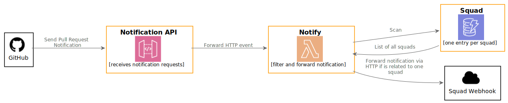

# ✉ GitHub Monorepo Pull Request Notifier
[](https://github.com/jpmoura/github-monorepo-pull-request-notifier/actions/workflows/cd.yml)
[](https://github.com/jpmoura/github-monorepo-pull-request-notifier/actions/workflows/ci.yml)
[](https://sonarcloud.io/dashboard?id=jpmoura_github-monorepo-pull-request-notifier)
[](https://sonarcloud.io/dashboard?id=jpmoura_github-monorepo-pull-request-notifier)
[](https://sonarcloud.io/dashboard?id=jpmoura_github-monorepo-pull-request-notifier)
[](https://sonarcloud.io/dashboard?id=jpmoura_github-monorepo-pull-request-notifier)

This is a serverless application that filters GitHub Pull Request notifications of a monorepo and forwarding them to squads of interest. At this point, only notification of opened pull requests will be analyzed.

Built using Node.js with TypeScript and powered by [Serverless Framework](https://www.serverless.com/).

[Since GitHub notification webhook does not follow redirects](https://github.com/isaacs/github/issues/574), the main goal of this application is filter and forward manually the notification request to squad's custom webhook.

## 1. Project architecture 🏠

This project uses clean code approach with repository pattern. The structure is the following:

```
|-\migrations
|----\seeds
|-\src
|----\domain
|--------\dto
|--------\enum
|--------\model
|--------\use-case
|--------\validator
|----\infra
|--------\provider
|--------\repository
|----\use-case
```

There are only one function:

1. `Notify`: responsible to filter notification based on squad's filter token and forwarding the notification if a squad is related to that Pull Request

Each directory will be discussed in the following subsections.

### 1.1 `migrations` directory
Contains a `seed` subdirectory which has all seed files for all DynamoDB tables used in the application.

### 1.2 `src` directory
Contains all source files separated by responsibilities like `domain`, `infra` and `use-case`

1. `api`: contains all handlers for API Gateway integration
2. `domain`: contains all interfaces used across the application
3. `infra`: contains all data repositories at this point
4. `use-case`: contains all business logic

### 1.3 Big Picture



## 2. Environment Configuration 🔧

A example of a stage `.env` should be:

```
DYNAMO_TABLE_PREFIX="YourStageName.GitHubMonorepoPullRequestNotifier"
```

For a local stage a.k.a. debug, just create a `.env.local` with the following content:
```
SLS_DEBUG=*
AWS_REGION="local"
AWS_ACCESS_KEY_ID="fake-access-key-id"
AWS_SECRET_ACCESS_KEY="fake-secret-access-key"
DYNAMO_TABLE_PREFIX="Local.GitHubMonorepoPullRequestNotifier"
DYNAMO_PREFIX_ENDPOINT="http://localhost:5000"
```

If you want a debug behavior just insert the entry `SLS_DEBUG=*` or remove it otherwise.

For convenience there is a the [`.env.example`](.env.example) already in this repo.

The model used for squad configuration table follows the schema:

```json
{
  "id": "my-squad",
  "webhook": "https://my.squad/webhook",
  "filterToken": "mysquad-service"
}
```

## 3. Run 🏃‍♂️

After setting the `.env.local` file just run the command `yarn` to install all dependency packages and after it finished run `yarn start` or for short `yarn && yarn start`.

### 3.1 Debug 🐛
If you are using Windows as platform will be necessary to install the Serverless framework globally using the command `yarn global add serverless`.

If you use Visual Code Studio all the launch parameters are already configured in [`launch.json`](./.vscode/launch.json).
